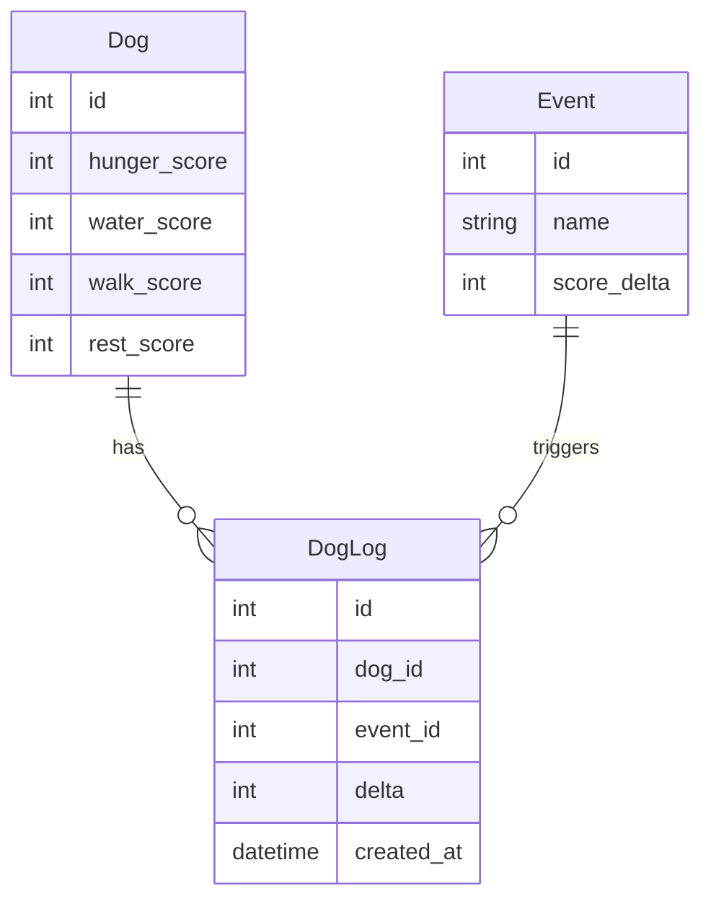

# 🐶 Smart Collar MVP Dog Care Tracker

## 📌 Описание проекта

MVP-проект, моделирующий систему мониторинга для собаки.

Система позволяет отслеживать базовое состояние питомца:
- сытость, например, 12 (это в часах)
- вода, например, 3, каждые три часа собака пьет водичку
- прогулка, например, 10-12 часов
- отдых, например, 8 часов

Если есть понимание, что как-то иначе очки (часы) представить? В процентах, например.

И фиксировать действия пользователей, которые влияют на эти показатели.

Зачем это нужно. Два, три, четыре заботливых хозяина могут перекормить, недогулять, переживать, хотеть знать как там их любимый питомец.

Папа, мама, дедушка и бабушка, брат и сестра с интервалом в 30 минут накормили собачку, не зная о действиях друг друга, собачка пошла делиться впечатлениями от испытанного счастья на пол.

Собака одна, для текущей версии 1.0 достаточно. Вроде бы.

Не важно как события приходят, с датчиков, от пользователей, от операторов которые фиксируют действия по телефонному звонку. Имитируем бизнес логику, только это, кажется распыляться не стоит.

Сущности пользователя нет, количество пользователей неограничено. Принимаем как данность, что никто не хочет причинить вред собаке, набузовать мусорных данных или скрыть, что не гулял с ней.

Ошибки ввода данных и откат пока тоже не учитываем. Выдуманная служба техподдержки поправит все ошибки в базе золотыми прямыми ручками по кнопке "Сделать хорошо".

Проект сделан как симуляция без реального устройства, датчиков или IoT-интеграций. Все действия вводятся вручную через консоль/интерфейс (не важно).

Значения показателей - это время в часах. Как некий healthbar/Hit points.

Цель этого текста — поделиться моим видением:
- базовой архитектуры приложения
- работы с состоянием
- работы с базой данных
- бизнес-логики
- событийной модели

С этим мнением не нужно соглашаться.

---

## 👤 Как это выглядит для пользователя

Пользователь взаимодействует с системой через простые команды:

- `feed` — покормить собаку;
- `water` — дать попить воду, или каким-то волшебным образом данные пришли, абстрагируемся от этого;
- `walk` — как известно работа не волк, волк это гулять;
- `rest` — отдых;
- `status` — текущее состояние;
- `logs` — история действий, можно ограничить, например, выводом за 1 день;
- `tick` — имитация прошедшего времени (+1 час), пока MVP я думаю это ок;
- еще нашлёпать действий будет интересно: поиграть дома или почесать, помыть, погладить.

### 📊 Система состояния

У собаки каждый показатель:
- имеет максимум, максимумы имеет смысл тоже упаковать в таблицу, например, отдельную, которая свяжется с ивентами;
- постепенно уменьшается со временем;
- увеличивается от действий пользователя;
- значение можно задавать используя опыт взаимодействия с собакой (это может быть хардкод при запуске приложения, при создании таблицы - инсерт данных и тд.);
- можно ввести другие значения или отказаться от текущих в пользу других;
- всякие коллизии не рассматриваем, типо у отдыха и прогулки значения по нулям, что же делать (?) завалиться спать или тащить на улицу, это абстрактная собака, она может всё .без коллизий;
- скорее всего мы не дожидаемся значения 0, а своевременно всё делаем, с заботой, легко, мягко и непринужденно, если будет значение "ноль" можно нотификацию сделать, при вызове tick или status. Вроде как "Алярм! Свистать всех наверх! Собаку надо погулять!"

---

## ⏱ Механика времени (`tick`)

Так как проект учебный и не использует фоновые процессы, время моделируется вручную.

Команда `tick` означает:
> прошёл 1 час

После выполнения:
- все показатели уменьшаются (например, на -1)
- система имитирует естественные потребности собаки (неестественно, но имитирует как умеет)

Это упрощение сделано специально для MVP, чтобы не использовать:
- cron
- background workers
- scheduler’ы/планировщики

---

## ⚠️ Важные ограничения MVP

Проект сознательно упрощён. По крайней мере у меня в голове.

Здесь нет:
- авторизации
- пользователей и ролей безопасности
- IoT-устройств
- фоновых сервисов
- сложной распределённой архитектуры

Хотя в реальности с собакой могут взаимодействовать разные люди, система не занимается безопасностью и разграничением доступа.

Любой пользователь считается равноправным участником системы, если конечно захардкодить туда пользователей или положить их в базу как отдельную таблицу, это будет манифик.

---

## 🧱 Архитектура (слои системы)

Проект разделён на 3 слоя:

### 1. Presentation Layer
Слой взаимодействия с пользователем. Вероятно один модуль/файл. Разбивать на классы, наверно, тоже не имеет смысла. Уже достаточно интеллектуальной ярости разделить на слои.

Отвечает за:
- ввод команд: принятие из консоли или другого источника, найти в ветвлении соответствие, пользователь ввел `tick`, нашли `tick` в условиях, выполняем действие.
- вывод состояния
- отображение логов
- возможно валидация и обработка ошибок

Не содержит бизнес-логики. И не знает как там что у бизнеса.

---

### 2. Business Logic Layer
Основная логика системы.

Отвечает за:
- изменение состояния собаки
- обработку команд, добавление значений;
- уменьшение показателей через `tick`
- ограничения (0 ≤ score ≤ max), валидация, score это значения показателей
- формирование логов

Это ядро проекта. Сейчас подумал, что для прикола можно выводить например общий показатель. Не status, а еще evaluation, тоже по команде - собираем значения, придумываем формулу, что-то такое: если показатели не ниже 50% говорим пользователю "Всё круто! Success".
А еще по команде help выводим список команд. Ну и приветствие: "Здравствуй милый друг и любитель животных! Вот тебе список команд <... тут команды>, а если забыл, отправь help и список еще раз пришлю."

---

### 3. Data Layer
Слой работы с базой данных.

Отвечает за:
- сохранение состояния
- чтение состояния
- запись логов
- получение справочных данных

Не содержит бизнес-логики.

---

## 🗄 Структура базы данных

### event_types

Справочник типов событий.

Определяет:
- название события
- какой показатель изменяется
- величину изменения

Это по разбивка столбцам.

Примеры:
- feed → hunger +3 //тут я обозначаю, что команда feed, а переменная и столбец в базе или сама структура бывает называется иначе - "hunger", хотя проще одно и то же название использовать, чтобы не запутаться, хз как лучше.
- walk → walk +4
- water → water +2
- rest → rest +2

---

### dog_status

Текущее состояние собаки. Таблица с одной записью (по количеству питомцев).
Вообще круче наверно было бы pet_status и уйти от dog в названиях, но так пока кажется интереснее и соответствует изначальной идее "умный ошейник". Про ящериц и котиков не думаем сейчас.

Хранит:
- hunger_score
- water_score
- walk_score
- rest_score
- всё важное

Особенности:
- в MVP только одна собака
- всегда одна запись
- опционально добавить предполагается столбец id, это будет неплохо, сразу с перспективой второго питомца, а может и не нужен id
- для красоты добавим name, всё же писать приложение для любимой собаки приятнее. Вообще тут полей можно вырастить сколько душа пожелает: и породу и дату рождения, пусть лежат хранятся. Заказчики скажут убрать - уберем.

---

### dog_logs

Журнал всех действий.

Хранит:
- событие
- изменение состояния
- время выполнения
- идентификатор нужен/не нужен, достаточно времени-даты?
- сюда стоит добавить само значение текущее.

Используется для:
- истории
- отладки
- анализа поведения системы

---

## 🔗 Связи между таблицами

Структура связей простая:

- `event_types` → используется в `dog_logs` как справочник типов событий
- `dog_logs` фиксирует каждое действие пользователя и его влияние на состояние
- `dog_status` хранит текущее состояние и не участвует в сложных связях

Итог:
- `event_types` задаёт правила
- `dog_status` хранит текущее состояние питомца
- `dog_logs` хранит историю

---

## 📈 Возможные расширения проекта

Проект можно развивать без изменения базовой архитектуры (это, чтобы понимать, что приложение не просто поделка):

- добавление нескольких питомцев
- полноценные пользователи
- web-интерфейс или мобильное приложение
- автоматическое время без `tick`
- уведомления о состоянии собаки
- графики активности
- GPS-трекинг прогулок
- интеграция с реальными IoT-устройствами
- аналитика поведения питомца

---

## 🧩 ER-диаграмма (Mermaid)

Диаграмма отражает структуру данных и связи между сущностями.
Можно без id в Dog и dog_id в DogLog, но не будем экономить на спичках. Я всё же вижу с id, с этим предполагаю можно спорить.
По названиям таблиц нет предела совершенству.
event_types неверно поинтереснее и точнее, чем Event

# 🍖 Команда FEED — полный путь выполнения (пример с псевдокодом)

---

## 👤 Ввод пользователя (Console)

Пользователь вводит команду:

feed

---

## 🧩 Заходим в Presentation Layer (UI)

//тут вверху какие-то импорты модулей или функций из слоя бизнеса

function main():
{
    input = read_console() //что-то прочитали откуда-то (из консоли)

    command = parse_command(input) // как-то распарсили или просто проверили что всё ок

    if command.type == "FEED":
        result = service.feed() //если feed, то вызываем из слоя бизнес логики метод/функцию/процедуру
        print(result)
}
---

## 🧠 Service Layer (Business Logic) отдельный модуль/файл с логикой, возможно как-то еще подробить можно

//тут вверху какие-то импорты из слоя данных
function feed():
{
    status = repository.get_status() //забрали из БД текущий статус/состояние питомца, значение желания немного перекусить и подкрепиться
    event = repository.get_event("feed") //забрали из БД событие

    old_hunger = status.hunger //записали старые значения

    status.hunger = status.hunger + event.delta //изменили значения текущего состояния на новые

    if status.hunger > MAX_HUNGER: // тут какие-то проверки, например ограничения на максимальное
        status.hunger = MAX_HUNGER

    repository.save_status(status) // положили в базу новое значения состояния

    repository.log_event({ //в лог положили предыдущие данные, после успешных операций
        event_name: "feed",
        old_value: old_hunger,
        new_value: status.hunger,
        delta: event.delta
    })

    return status //возвращаем что-то, типа какое сейчас состояние
}
---

## 🗄 Data Layer (Repository) операционные дела - забрать из базы, положить, проапдейтить

function get_status():
    return DB.SELECT_ONE("SELECT * FROM dog_status")

function get_event(name):
    return DB.SELECT_ONE("SELECT * FROM event_types WHERE name = name")

function save_status(status):
    DB.EXECUTE("UPDATE dog_status SET hunger=?, water=?, walk=?, rest=?, updated_at=NOW()")

function log_event(log):
    DB.EXECUTE("INSERT INTO dog_logs(event_name, old_value, new_value, delta, created_at) VALUES (...)")

---

## 🗄 Database (изменение состояния), пример что происходит с данными

BEFORE:
hunger = 5

EVENT:
feed (+3)

AFTER:
hunger = 8

dog_logs:
feed | 5 → 8 | +3

---

## 🔁 Общий поток выполнения

Console → UI слой → Service → Data → DB база (идем обратно по слоям) → Data → Service → UI → Console

прошли из консоли - по слоям пошли до базы данных (DB), вернулись в консоль с ответом

---

## 🧠 Смысл

UI слой:
- принимает ввод
- вызывает сервис
- выводит результат

Service слой:
- применяет бизнес-логику
- изменяет состояние

Data слой:
- читает и записывает данные

Database:
- хранит состояние и историю

# ⏱ Команда TICK — полный путь выполнения (пример с псевдокодом)

---

## 👤 Ввод пользователя (Console)

Пользователь вводит команду:

tick

---

## 🧩 Presentation Layer (UI)

function main():
{
    input = read_console()

    command = parse_command(input)

    if command.type == "TICK":
        result = service.tick()
        print(result)
}
---

## 🧠 Service Layer (Business Logic)

function tick():
{
    status = repository.get_status()

    status.hunger = status.hunger - 1
    status.water = status.water - 1
    status.walk = status.walk - 1
    status.rest = status.rest - 1

    if status.hunger < 0: //вероятно логичнее сразу проверять, а может даже мелкую функцию для проверки значения
        status.hunger = 0

    if status.water < 0:
        status.water = 0

    if status.walk < 0:
        status.walk = 0

    if status.rest < 0:
        status.rest = 0

    repository.save_status(status)

    repository.log_event({
        event_name: "tick",
        old_value: "multiple",
        new_value: "multiple",
        delta: -1
    })

    return status
}
---

## 🗄 Data Layer (Repository)

function get_status():
    return DB.SELECT_ONE("SELECT * FROM dog_status")

function save_status(status):
    DB.EXECUTE("UPDATE dog_status SET hunger=?, water=?, walk=?, rest=?, updated_at=NOW()")

function log_event(log):
    DB.EXECUTE("INSERT INTO dog_logs(event_name, old_value, new_value, delta, created_at) VALUES (...)")

---

## 🗄 Database (изменение состояния)

BEFORE:

hunger = 5  
water = 6  
walk = 7  
rest = 4  

EVENT:

tick (-1 all)

AFTER:

hunger = 4  
water = 5  
walk = 6  
rest = 3  

dog_logs:
tick | state decreased | -1

//тут может быть в лог записывать и текущее состояние питомца второй записью

---

## 🔁 Общий поток выполнения

Console → UI → Service → Data → DB → Service → UI → Console 

---

## 🧠 Смысл

UI слой:
- принимает команду
- передаёт в сервис
- выводит результат

Service слой:
- уменьшает показатели со временем
- применяет ограничения (не ниже 0)

Data слой:
- сохраняет изменения
- пишет лог

Database:
- хранит текущее состояние и историю

## 🎯 Итого

Тут описан вариант простецкой, чуть водянистой модели. Простые модели часто устойчивее, потому что их проще понимать, проверять и менять. Но это не значит, что решение хорошее. А так - тут всё просто, а перегруз архитектуры на старте вреден.

В таких проектах легко начать “докручивать” систему (и себя) до бесконечности, теряя ощущение реального масштаба проекта и реальности. Иногда лучший шаг - остановиться, упростить и признать, что текущего уровня достаточно, чтобы двигаться дальше. В конце концов принять, что слишком хорошо - тоже нехорошо.

Если появляется ощущение, что система начинает разрастаться быстрее, чем сам её понимаешь: какие-то переменные, счетчики, куча функций, перепроверок, перестраховок, "а вдруг кто-то дал собаке не её корм, а сосиску, как это отразить?" - ответ "никак". Всё равно всего-всего не предусмотришь.
